<!-- Please do not change this logo with link -->

# Curiosity Nano Out-of-the-Box Code

This project comes preloaded on the Curiosity Nano board when the user first plugs it in. It consists of three programs and a command line that enables choosing between those programs. 

- The first program is a simple LED blinking program. The microcontroller starts with this program being activated
- The second program turns on the existing on-board LED by pressing a button on the Curiosity Nano board
- The third program sends an 8-bit counter through USART when the on-board button is pressed. This increases the counter.. 

The main program is changed by sending one of the numbers 1, 2 or 3 through USART. Any other key will return the menu.  

## Related Documentation

For more details and code examples on the AVR64DD32 click on the following links:

- [AVR64DD32 Product Page](https://www.microchip.com/wwwproducts/en/AVR64DD32)
- [AVR64DD32 Code Examples on GitHub](https://github.com/microchip-pic-avr-examples?q=AVR64DD32)
- [AVR64DD32 Project Examples in START](https://start.atmel.com/#examples/AVR64DD32)

## Software Used

- [MPLAB® X IDE](http://www.microchip.com/mplab/mplab-x-ide) v5.50 or newer
- [MPLAB® XC8](http://www.microchip.com/mplab/compilers) v2.32 or newer
- [MPLAB® Code Configurator (MCC)](https://www.microchip.com/mplab/mplab-code-configurator) v5.0.3 or newer 
- MPLAB® Code Configurator (MCC) Device Libraries 8-bit AVR MCUs v2.8.0 or newer
- AVR-Dx 1.10.124 or newer Device Pack
- MPLAB® Data Visualizer

## Hardware Used

- AVR64DD32 Curiosity Nano Board

## Setup

The AVR64DD32 Curiosity Nano Development Board is used as a test platform.

 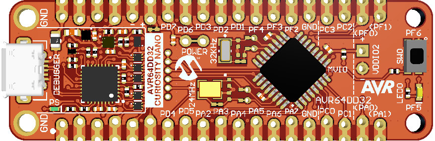

The following configurations must be made for this project:

 - System clock: 24 MHz
 
 The System Module MCC Configuration is presented in the picture below.
 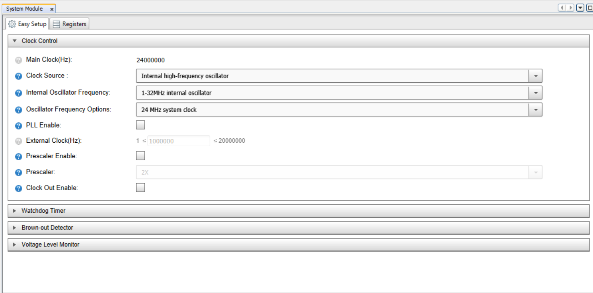

 - USART0 is configured for 115200 baud, with the receiver and transmitter enabled, 8N1 and printf support.
 
 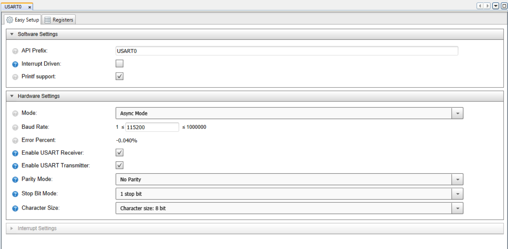
 
 - USART0 is routed to CDC pins for more flexibility, by using Port Multiplexing.
 
 - UPDI pin must be configured as UPDI pin and not as GPIO pin.

The initial pin configurations are presented in the table below.

|    Pin      | Configuration  |
| :---------: | :------------: |
| PD4 (TX)    | Digital output |
| PD5 (RX)    | Digital input  |
| PF5 (LED)   | Digital output |
| PF6 (Button)| Digital input  |

**Note:** Pin PF6 (Button) has pull-up enabled.

## Operation

To program the Curiosity Nano board with this MPLAB® X project, follow the steps provided in the [Program.md](./Program.md) page.

## Showcases and Demo:

### 1. LED Blink

The first program is a simple LED blinking program. The program is activated when the microcontroller is plugged in.
To run the first project, send the command `1` through USART by using the Data Visualizer. After sending this number, the terminal will receive the following message: `"Program changed to blink LED"`.
  Demo:
 
 
### 2. Push the button to turn on the LED

The second program turns on the on-board LED by pressing the button on the Curiosity Nano board.
To run the second project, send the command `2` through USART using Data Visualizer. After sending this number, the terminal will receive the following message: `"Program changed to press button to turn on LED"`.
  Demo:
  

### 3. Ramp on Data Visualizer

While the on-board button is pressed, the third program sends an 8-bit counter through USART and increases the counter.
To run the third project, send the command `3` through USART using Data Visualizer. After sending this number, the terminal will receive the following message:`"Program changed to press button to send a ramp through USART"`.

Follow the steps in the **How to use MPLAB® Data Visualizer** section to set up the Data Visualizer so that it can correctly view the ramp through USART0 sent by pressing the button.

  **Note:** The next demo is at 8x speed.

  Demo:
 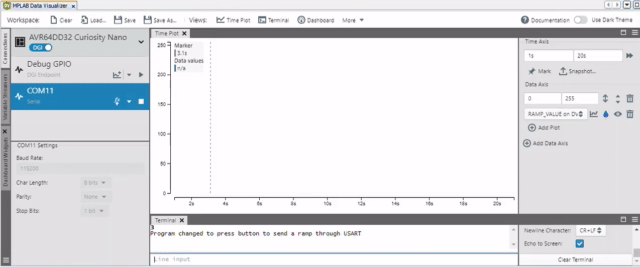
 
**Note:** By pressing any other key, the program returns the menu through USART using the software terminal.

## How to use MPLAB® Data Visualizer

This section illustrates how to use the MPLAB® X Data Visualizer to send commands and receive information, but prior to programming the AVR64DD32 Curiosity Nano Board. This can be applied to any other projects.

### Operation

1. Open the software terminal in MPLAB® X IDE. Left click on the **Data Visualizer** button.

 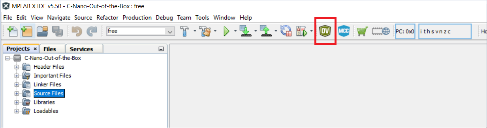

2. Prepare settings in Data Visualizer.
- Left click on the specific serial port communication **COMx**
- Set the correct **Baud Rate**
- Select the right **Input Source**
- Press the **Start** button.

 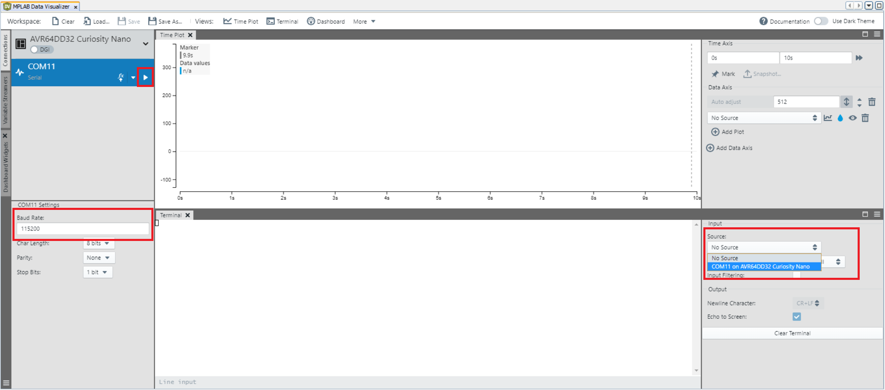

3. Start using the programs. Left click on the **Line input**, type any key, send commands.

 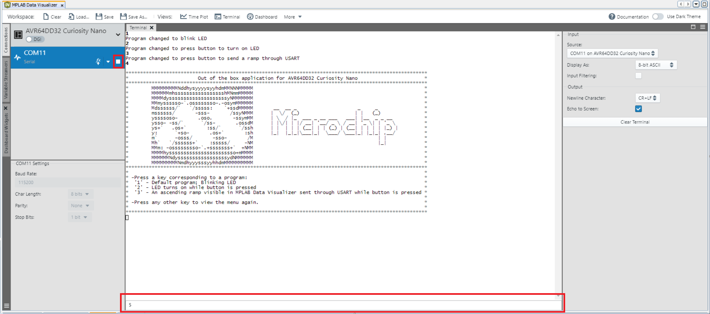

**Note:** The next steps must be followed to run the third program.

4. Prepare MPLAB® Data Visualizer. Right click on the **Important files**, click **Add Item to Important Files...** .

 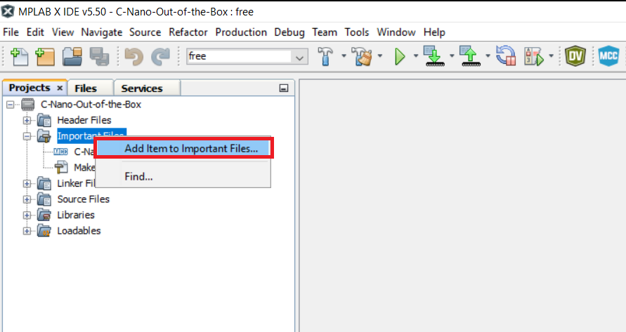

**Note:** Step 5 will be followed only if there is no existing setup file for Data Visualizer. Otherwise go to Step 6.

5. Prepare MPLAB® Data Visualizer.
- In the **Connections** tab, at the **COMx** option, press **New variable streamer...**
- Type a specific **Variable Streamer Name**
- Choose **Ones' Complement** from the **Framing Mode** dropdown menu
- Type a specific value from the **Start of Frame**, press **Add a variable**
- Type a specific name for the variable name in **Variable Name**
- Press **Next**, after that press **Next** again
- Save these settings using **Save As** button as a json file.

 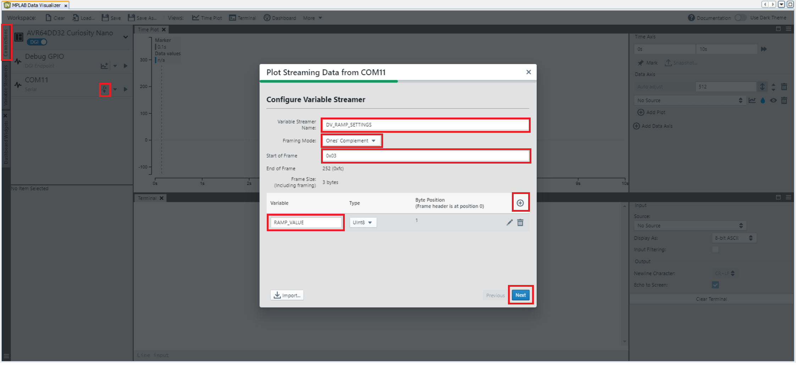

6. Add the json file to see the ramp using Data Visualizer. Click on the ***.json file** and **Select**.

 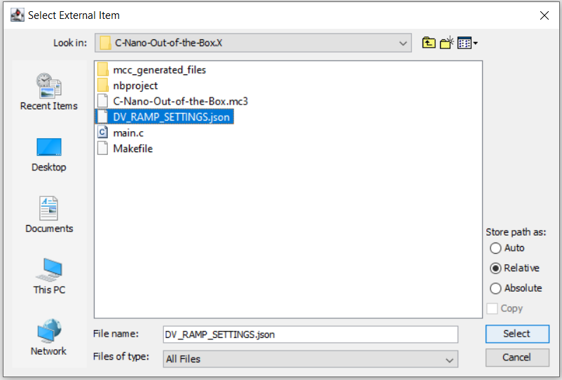

7. See the expected result on Data Visualizer.
- Double click on the ***.json file** from **Important Files** 
- Select **Source** from Time Plot window
- Click **Start Streaming COMx** the communication serial port
- Click **Scroll axis automatically**.

 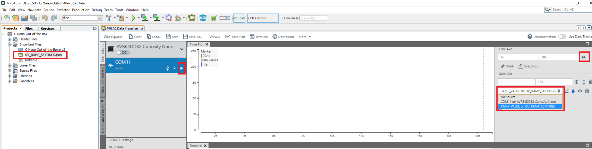

## Summary

This project is an out-of-the-box experience for the first-time user. It showcases the basic features of the Curiosity Nano Development platform.
